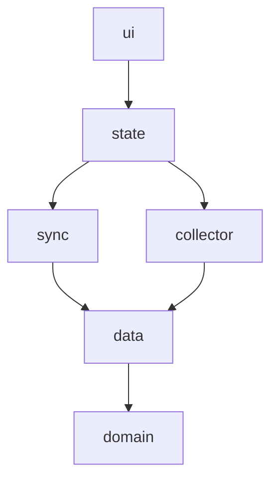

# Lupira Assistant — App backbone

**Status:** design record — the **intended final state** + rationale; it does not track build status. Implementation status + remaining work live in `docs/roadmap.md`. Scope here = the **mobile client**; the hub it talks to is `../LupiraAssistantApi/docs/assistant-backbone.md`.

**Reads with:** the product brief (`docs/product-brief.md`) for intent, and the hub backbone (`../LupiraAssistantApi/docs/assistant-backbone.md`) for the contract it consumes. The substrate backbones (`LupiraCalApi`, `LupiraTasksApi`, `GptApi`) matter only as the hub's downstream — the app never touches them directly.

## Purpose & role
The app is the **user-facing surface** — the only surface Daniel touches; everything else is invisible plumbing. It is a **thin client**: no LLM, no agent logic, no voice, no chat thread. It renders the assistant's proposals, questions, and digests, and relays a tap or a short answer back — proactive **propose→confirm**, never an open-ended query. All reasoning lives in assistant-api; the app never calls the gateway.

Two halves:
- **Background substrate** — sign-in, device registration, the store-and-forward location stream, the on-behalf-of grant enrollment.
- **The canonical surface** — an interactive Inbox (Approve/Edit/Dismiss, answer questions, reminders, digests), native push, and in-app connectors & preferences. The hub's Telegram bot stays an optional secondary confirm channel.

## Foundation it reuses
The app is already built on the primitives the new surfaces need; they **extend** these, nothing is reinvented.

- **Layered architecture**, downward-only, enforced by `eslint-plugin-boundaries` v6 ([eslint.config.mjs](../eslint.config.mjs)). The spine: `domain → data → {collector, sync} → state → ui`, with cross-cutting leaves (`config`, `debug`, `feedback`, `polyfills`) importable by anyone but importing no app layer. `collector` (headless background tasks) and `sync` may **not** reach `state`/`ui`; the sync-status store lives inside `sync/`, so `sync` never imports `state`.

- **Auth** — Authentik OIDC public PKCE (`expo-auth-session`), client `lupira-assistant`, tokens in SecureStore, on-demand refresh with single-flight dedup and a definitive-vs-transient split ([src/data/auth/oidc.ts](../src/data/auth/oidc.ts), [src/state/auth-store.ts](../src/state/auth-store.ts)). The data layer reaches the live token through auth-ports, never importing `state`.
- **Device identity** — registration mints a location-api `DeviceKey` (`Authorization: DeviceKey {apiKey}`), SecureStore-only ([src/data/api/registration.ts](../src/data/api/registration.ts)). This is the **ingest** credential; assistant-api is called with the **OIDC bearer** — a separate credential.
- **Store-and-forward queue** — a **multi-stream** offline pipeline: SQLite `pending_*` tables, a `sync_state(device_id, stream, …)` cursor, a monotonic per-stream `seq` keyed for `location`/`ring`/`summaries` ([src/domain/seq.ts](../src/domain/seq.ts)), NDJSON batch upload, and **idempotent receipt apply** that deletes accepted / drops permanent rejects / retries transients ([src/domain/receipt-apply.ts](../src/domain/receipt-apply.ts), [src/sync/uploader.ts](../src/sync/uploader.ts), [src/sync/sync-engine.ts](../src/sync/sync-engine.ts)). Because the queue is already stream-keyed, a new `acks` stream is an addition, not a rewrite.
- **Reliability** — a server-driven **pause** kill-switch honored by the uploader ([src/sync/pause-poll.ts](../src/sync/pause-poll.ts)); **cursor-resume** seeds `seq` to max(local, server cursor) so a reinstall can't reuse sequence numbers ([src/sync/cursor-resume.ts](../src/sync/cursor-resume.ts)); Sentry error boundary at the root.
- **Three backends** — API bases `health | location | assistant` ([src/data/api/auth-ports.ts](../src/data/api/auth-ports.ts)): HealthApi (bootstrap/records + the ring/summaries streams, its own device key), location-api (fix ingest, `DeviceKey`), assistant-api (OIDC bearer). HealthApi and location-api are direct spokes, not behind the hub.

## Credentials & grant enrollment
**Two distinct credentials are established at sign-in** — kept separate to avoid confusion:
1. **App session** — the public PKCE client `lupira-assistant`; its bearer authorizes the app's own calls to the assistant-api REST surface. The `offline_access` on this client is the *app's* session longevity. (assistant-api must be a valid audience for this client — see Open decisions.)
2. **Assistant-api offline grant** — assistant-api is a **confidential** Authentik client. The grant is a per-user refresh token minted to **assistant-api** (encrypted, schema `assistant`), letting it write on-behalf-of the user when the user is absent (a 3am fired prompt). The app does not hold this token; it only triggers its creation.

**Grant enrollment is assistant-api-led.** The app launches the hub's hosted flow (`expo-web-browser`) and the server owns the auth-code dance:
1. App completes PKCE login → app session token.
2. App opens the hub's `GET /auth/login`, which challenges into the server-side auth-code consent — the consent screen is the **least-privilege gate** for which substrates the assistant may write (cal / tasks / career).
3. The OIDC callback (`/auth/callback`) captures + encrypts the refresh token; the flow lands on `/auth/done`, which hands control back to the app via the return deep link (`lupiraassistant://connected`) — the return-leg contract is an Open decision.
4. App reads grant status from `GET /auth/status` (`{hasGrant, status, audiences}`) and reflects **connected** vs **re-auth needed**.
5. If the grant expires or is revoked, the hub parks the affected fires and raises a re-auth notice; the app surfaces a **reconnect** prompt that re-launches the flow. Revoking the grant in Authentik is the clean kill-switch.

There is no device-code path — Authentik lacks the endpoint, so the hosted browser flow is the only enrollment route.

## Surfaces
- **Inbox / Suggestions** — the assistant's queue (proposals, open questions, reminders, digests) fetched from the hub; the last fetch is cached locally so it renders offline. Approve / Edit / Dismiss proposals; answer or skip elicited questions. Every write is optimistic in the UI and rides the offline-sync **ack queue** (below) for idempotent replay.
- **Native push** — register an Expo push token with the hub (`expo-notifications` → Expo push service → FCM/APNs, matching the hub backbone's "Expo→FCM/APNs"). A notice tap deep-links to the relevant Inbox item. The token is unregistered on logout.
- **Connectors & preferences** — start Gmail/Outlook OAuth (the hub holds the token vault and runs the hosted consent; the app only kicks it off and shows status), paste the Facebook events iCal URL, link Telegram and opt individual chats in or out, and set delivery preferences (per-item vs digest, quiet hours).

## Module & screen layout
Everything slots into the **existing** element types — no new layer, no `eslint.config.mjs` change.

| Piece | Layer | Notes |
|---|---|---|
| Proposal / question / digest types; ack & answer payloads; connector & preference types | `domain/assistant/` | Pure types + mapping, matching the existing domain style |
| `ack-receipt-apply.ts` | `domain/assistant/` | Idempotent ack reconciliation; mirrors `receipt-apply.ts` |
| Generated clients `generated/{assistant,location,health}/` | `data/api/` | Orval output from each OpenAPI spec |
| `mutator.ts` | `data/api/` | Injects the **OIDC bearer** for assistant-api; `DeviceKey` stays for ingest |
| NDJSON ingest serializer | `data/api/` | Custom request fn through the shared mutator — NDJSON isn't standard JSON, so Orval can't model it |
| `pending-acks-repo.ts` + `pending_acks` table | `data/db/` | Mirrors `pending-fixes-repo.ts`; reuses `seq.ts` with stream `acks` |
| Inbox cache repo | `data/db/` | Persists the last Inbox fetch for offline read |
| Enrollment launcher + return handling | `data/auth/` | Opens the hosted `/auth/login`, resolves the deep link |
| Expo push token registration | `data/push/` | Registers the token with the hub |
| `ack-uploader.ts` | `sync/` | acks-stream uploader; mirrors `uploader.ts`, reuses the sync-engine loop + triggers |
| `acks` stream registration | `sync/sync-engine.ts` | A second stream alongside `location` |
| `inbox-store.ts` | `state/` | Inbox read + optimistic ack |
| `connectors-store.ts`, `preferences-store.ts` | `state/` | Connector list + status; delivery prefs |
| `InboxScreen.tsx` | `ui/screens/` | Read + resolve/answer |
| `ConnectorsScreen.tsx`, `PreferencesScreen.tsx` | `ui/screens/` | |
| Navigation | `ui/navigation/` | Tab layout (Inbox / Settings) |
| Notification display + tap-routing | `ui/` + `App.tsx` | `expo-notifications` handlers wired at the root |

## API integration
The app consumes the hub's REST surface through the Orval-generated `assistant` client. Auth + profile are contracted; endpoints marked ✶ are proposed here and co-designed with assistant-api before clients are generated.

| Endpoint | Purpose |
|---|---|
| `GET /auth/login` → `/auth/callback` → `/auth/done` | Hosted offline-grant enrollment (auth-code) |
| `GET /auth/status` | Grant status: `{hasGrant, status, audiences}` |
| `GET /me/profile` · `PUT /me/profile/routing` | Profile + routing defaults |
| `GET /inbox?status&cursor` ✶ | Proposals + open questions + reminders + digests |
| `POST /proposals/{id}/resolve` ✶ | `{action: approve\|edit\|dismiss, edits?}`; idempotent on a client action id |
| `POST /checkins/{id}/answer` ✶ | Answer or skip an elicited question; idempotent |
| `POST /push-tokens` · `DELETE /push-tokens/{id}` ✶ | Register / drop the Expo token |
| `GET /connectors` · `DELETE /connectors/{id}` ✶ | List / revoke a source |
| `POST /connectors/{google\|outlook}/oauth/start` ✶ | Returns the hosted OAuth URL |
| `POST /connectors/facebook-ical` ✶ | `{url}` — register the events iCal feed |
| `POST /connectors/telegram/link` · `…/chats/{chatId}/opt-in` ✶ | Link the bot, opt a chat in/out |
| `GET /preferences` · `PUT /preferences` ✶ | `{mode: per-item\|digest, quietHours, …}` |

**Idempotency requirement:** every write the app may replay carries a client-generated action id; the hub must dedup on it. Its event-sourced `ProposedAction` / `ApprovalRequest` model already fits — an approve/edit/dismiss is an event, so replaying it is a no-op.

## Offline-sync reuse — the `acks` stream
Inbox writes (resolve, answer) don't get a bespoke network path. Each enqueues to a `pending_acks` table with a monotonic `acks`-stream `seq`, exactly as location fixes enqueue to `pending_fixes`. The existing sync-engine — single-flight, kicked by NetInfo reconnect, AppState foreground, the background task, and manual triggers — flushes them via `ack-uploader.ts`. The hub dedups on the client action id and returns an ack-receipt; applying it deletes accepted actions, drops permanent rejects, and leaves transients for retry, mirroring `applyReceipt`. Net: an approval made offline survives an app kill and replays safely the moment connectivity returns.

## Deferred sections (named, to expand)
- **Geofence registration** — the hub supplies geofences; the `collector` layer registers them via `Location.startGeofencingAsync`, turning arrival/departure into location-triggered nudges (leave-by, trip prompts). This reuses the existing background-location foundation.
- **Self-hosted map view** — render the user's own location history (the brief's deferred "Map view"); the heaviest future item, a tiles surface rather than a connector.

## Open decisions
- **Enrollment return leg** — how `/auth/done` hands control back to the app (deep-link redirect vs a `return_uri` param on `/auth/login`), plus state/PKCE on the hosted flow and binding the resulting grant to the correct principal (the app-session user).
- **Audience config** — confirm the `lupira-assistant` PKCE client carries assistant-api as an audience so its bearer is accepted by the hub.
- **Inbox shape** — one merged `/inbox` feed vs separate proposal/question/digest endpoints.
- **Resolve endpoint** — unified `/resolve` (recommended) vs separate approve/edit/dismiss routes.
- **Push credential ownership** — Expo-managed credentials vs a self-hosted APNs key / FCM project.
- **Per-chat Telegram opt-in UX** — list discovered chats vs add-by-id.
- **Orval + NDJSON** — keep ingest as a custom request fn through the shared mutator (recommended) vs leaving ingest fully hand-written outside Orval.
- **Inbox freshness until push lands** — pull-on-open vs a lightweight poll.
