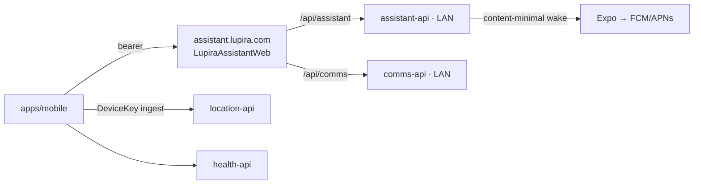
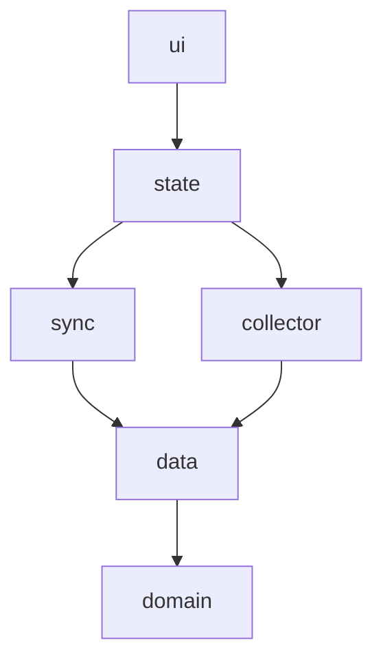

# Lupira Assistant — App backbone

**Status:** design record — the **intended final state** + rationale; it does not track build status. Implementation status + remaining work live in `docs/roadmap.md`. Scope here = the **monorepo's client side** (the mobile app, the shared domain package, and the BFF that fronts the backends); the hub is `../LupiraAssistantApi/docs/assistant-backbone.md`.

**Reads with:** the product brief (`docs/product-brief.md`) for intent, and the hub backbone (`../LupiraAssistantApi/docs/assistant-backbone.md`) for the contract it consumes. The substrate backbones (`LupiraCalApi`, `LupiraTasksApi`, `GptApi`) matter only as the hub's downstream — the app never touches them directly.

## Purpose & role
The app is the **user-facing surface** — the only surface Daniel touches; everything else is invisible plumbing. It is a **thin client**: no LLM, no agent logic, no voice, no chat thread. It renders the assistant's proposals, questions, and notices, and relays a tap or a short answer back — proactive **propose→confirm**, never an open-ended query. All reasoning lives in assistant-api; the app never calls the gateway.

Two halves:
- **Background substrate** — sign-in, device registration, the store-and-forward location stream, the on-behalf-of grant enrollment.
- **The canonical surface** — an interactive Inbox (Approve/Edit/Dismiss, answer questions, notices), the comms archive browser, native push, and in-app connector status & preferences. The hub's Telegram bot stays an optional secondary confirm channel.

## Repo shape — a monorepo, one public backend
The client side is an npm-workspaces monorepo (the LupiraCalWeb pattern), so the mobile app and a future web SPA share pure logic instead of copying it:

| Path | What |
|---|---|
| `apps/mobile` | The Expo app — the canonical surface. |
| `packages/domain` | `@lupira/assistant-domain`: shared pure TS (inbox mapping, ack classification, edit specs, thread paging), consumed as source, vitest-tested, kept dependency-free by its own eslint config. |
| `src/LupiraAssistantWeb` | The **BFF**: .NET 10, Authentik bearer + YARP. The future SPA lands beside it. |

**One public backend.** The app talks to the BFF only; the path prefix picks the upstream (`/api/assistant` → assistant-api, `/api/comms` → comms-api). The BFF validates the app's bearer and forwards it verbatim — the upstreams validate it again (defence in depth), so both can drop off the public edge. It re-announces the stripped prefix as `X-Forwarded-Prefix` so the hub's hosted enrollment builds proxied callback URLs. HealthApi and location-api stay direct spokes (device-key ingest, unchanged).

## Foundation it reuses
The app is already built on the primitives the new surfaces need; they **extend** these, nothing is reinvented.

- **Layered architecture**, downward-only, enforced by `eslint-plugin-boundaries` v7 ([apps/mobile/eslint.config.mjs](../apps/mobile/eslint.config.mjs)). The spine: `domain → data → {collector, sync} → state → ui`, with cross-cutting leaves (`config`, `debug`, `feedback`, `polyfills`) importable by anyone but importing no app layer. `collector` (headless background tasks) and `sync` may **not** reach `state`/`ui`; the sync-status store lives inside `sync/`, so `sync` never imports `state`.

- **Auth** — Authentik OIDC public PKCE (`expo-auth-session`), client `lupira-assistant`, tokens in SecureStore, on-demand refresh with single-flight dedup and a definitive-vs-transient split ([src/data/auth/oidc.ts](../apps/mobile/src/data/auth/oidc.ts), [src/state/auth-store.ts](../apps/mobile/src/state/auth-store.ts)). The data layer reaches the live token through auth-ports, never importing `state`.
- **Device identity** — registration mints a location-api `DeviceKey` (`Authorization: DeviceKey {apiKey}`), SecureStore-only ([src/data/api/registration.ts](../apps/mobile/src/data/api/registration.ts)). This is the **ingest** credential; assistant-api is called with the **OIDC bearer** — a separate credential.
- **Store-and-forward queue** — a **multi-stream** offline pipeline: SQLite `pending_*` tables, a `sync_state(device_id, stream, …)` cursor, a monotonic per-stream `seq` keyed for `location`/`ring`/`summaries` ([src/domain/seq.ts](../apps/mobile/src/domain/seq.ts)), NDJSON batch upload, and **idempotent receipt apply** that deletes accepted / drops permanent rejects / retries transients ([src/domain/receipt-apply.ts](../apps/mobile/src/domain/receipt-apply.ts), [src/sync/uploader.ts](../apps/mobile/src/sync/uploader.ts), [src/sync/sync-engine.ts](../apps/mobile/src/sync/sync-engine.ts)). Because the queue is already stream-keyed, a new `acks` stream is an addition, not a rewrite.
- **Reliability** — a server-driven **pause** kill-switch honored by the uploader ([src/sync/pause-poll.ts](../apps/mobile/src/sync/pause-poll.ts)); **cursor-resume** seeds `seq` to max(local, server cursor) so a reinstall can't reuse sequence numbers ([src/sync/cursor-resume.ts](../apps/mobile/src/sync/cursor-resume.ts)); Sentry error boundary at the root.
- **Backends** — API bases `health | location | assistant` (the last now the BFF origin) ([src/data/api/auth-ports.ts](../apps/mobile/src/data/api/auth-ports.ts)): HealthApi (bootstrap/records + the ring/summaries streams, its own device key), location-api (fix ingest, `DeviceKey`), the assistant BFF (OIDC bearer, fronting assistant-api + comms-api). HealthApi and location-api are direct spokes, not behind the BFF.

## Credentials & grant enrollment
**Two distinct credentials are established at sign-in** — kept separate to avoid confusion:
1. **App session** — the public PKCE client `lupira-assistant`; its bearer authorizes the app's own calls to the assistant-api REST surface. The `offline_access` on this client is the *app's* session longevity. (assistant-api must be a valid audience for this client — see Open decisions.)
2. **Assistant-api offline grant** — assistant-api is a **confidential** Authentik client. The grant is a per-user refresh token minted to **assistant-api** (encrypted, schema `assistant`), letting it write on-behalf-of the user when the user is absent (a 3am fired prompt). The app does not hold this token; it only triggers its creation.

**Grant enrollment is assistant-api-led.** The app launches the hub's hosted flow (`expo-web-browser`) and the server owns the auth-code dance:
1. App completes PKCE login → app session token.
2. App opens the hub's `GET /auth/login`, which challenges into the server-side auth-code consent — the consent screen is the **least-privilege gate** for which substrates the assistant may write (cal / tasks / career).
3. The OIDC callback (`/auth/callback`) captures + encrypts the refresh token; the flow lands on `/auth/done?return_uri=…`, which 302s to the app's deep link (`lupiraassistant://connected`) when that URI is on the hub's allowlist — otherwise it renders the close-me page, so the leg can never become an open redirect. Both hops run through the BFF, which re-announces the stripped prefix so the callback URL matches what Authentik has registered.
4. App reads grant status from `GET /auth/status` (`{hasGrant, status, audiences}`) and reflects **connected** vs **re-auth needed**.
5. If the grant expires or is revoked, the hub parks the affected fires and raises a re-auth notice; the app surfaces a **reconnect** prompt that re-launches the flow. Revoking the grant in Authentik is the clean kill-switch.

There is no device-code path — Authentik lacks the endpoint, so the hosted browser flow is the only enrollment route.

## Surfaces
- **Inbox** — the assistant's queue (proposals, open questions, notices) fetched from the hub; the last fetch is cached locally so it renders offline. Approve / Edit / Dismiss proposals; answer or skip questions; dismiss notices. Every write is optimistic in the UI and rides the offline-sync **ack queue** (below) for idempotent replay.
- **Proposal editing** — a schema-driven editor covers all four payload kinds (event · contact · task incl. bill/delivery/reply detail · place). The field specs, immutable path edits, and typed input parsing live in `packages/domain/edit-spec.ts`, so one generic screen renders every kind and a future SPA reuses the same table. An edited payload is submitted as an `Edit` resolution; the hub re-validates it against the proposal's kind, so a malformed edit is a 400 at consent time, never a downstream write failure.
- **Archive** — search the comms corpus (hybrid semantic + full-text, reranked), browse conversations, and read a thread chat-style. A search hit jumps into its thread centred on the matched message (`around=`), and paging older merges by `(timestamp, id)` — the same total order the server pages on. Online-only: research is a deliberate act, so it isn't cached.
- **Native push** — register an Expo push token with the hub (`expo-notifications` → Expo push service → FCM/APNs). Payloads are **content-minimal** — a generic title plus the target and item id — so personal content never leaves the LAN; the app fetches the real item from the hub on open. A notice refreshes the inbox on arrival and deep-links on tap (including a cold start). The token is dropped on sign-out, and the hub prunes tokens Expo reports dead.
- **Connector status & preferences** — read-only capture health per source (granted connectors, message count, last arrival, so a stalled userbot or IMAP poller is visible) and delivery preferences (per-item vs digest, quiet hours + zone). Connector enrolment stays an ops-CLI act — credentials never travel over HTTP — so this surface reports rather than manages.

## Module & screen layout
Everything slots into the **existing** element types — no new layer, no `eslint.config.mjs` change.

| Piece | Layer | Notes |
|---|---|---|
| `inbox-item.ts`, `ack.ts`, `edit-spec.ts`, `thread-page.ts` | `packages/domain` | Shared pure logic: wire→view-model mapping, ack classification, per-kind edit specs, thread-page merging. Cross-frontend, so it lives in the package rather than the app |
| Generated clients `generated/{assistant,comms,location,health}/` | `data/api/` | Orval output; the assistant + comms targets carry their BFF prefix |
| `mutators.ts` | `data/api/` | Injects the **OIDC bearer** for the BFF-fronted backends; `DeviceKey` stays for ingest |
| NDJSON ingest serializer | `data/api/` | Custom request fn through the shared mutator — NDJSON isn't standard JSON, so Orval can't model it |
| `pending-acks-repo.ts` + `pending_acks` table | `data/db/` | Mirrors `pending-fixes-repo.ts`; reuses `seq.ts` with stream `acks` |
| Inbox cache repo | `data/db/` | Persists the last Inbox fetch for offline read |
| Enrollment launcher + return handling | `data/auth/` | Opens the hosted `/auth/login?return_uri=`, resolves the deep link |
| `push-registration.ts`, `push-session.ts` | `data/push/` | Mints + registers the Expo token; drops it on sign-out |
| `ack-uploader.ts` | `sync/` | acks-stream uploader; drains in seq order inside the sync-engine cycle |
| `acks` stream registration | `sync/sync-engine.ts` | A second stream alongside `location` |
| `inbox-store.ts` | `state/` | Inbox read + optimistic gestures |
| `archive-store.ts`, `settings-store.ts` | `state/` | Search / conversations / thread window; preferences + capture status |
| `InboxScreen.tsx`, `EditProposalScreen.tsx` | `ui/screens/` | Read + resolve/answer; the schema-driven editor |
| `ArchiveSearchScreen.tsx`, `ConversationsScreen.tsx`, `ThreadScreen.tsx` | `ui/screens/` | The archive browser |
| `ConnectorsScreen.tsx`, `PreferencesScreen.tsx` | `ui/screens/` | Capture status (read-only) + delivery preferences |
| Navigation | `ui/navigation/` | Inbox / Archive tabs, with Settings + detail screens pushed over them |
| Notification display + tap-routing | `ui/notifications.ts` + `App.tsx` | `expo-notifications` handlers wired at the root; `navigationRef` routes a tap |

## API integration
The app consumes both backends through Orval-generated clients — one target per upstream, each with its BFF prefix baked into `baseUrl`, so a call site never knows which host answers. Specs come from the API repos' build output (`npm run fetch:openapi`), never a running server.

**assistant-api** (`/api/assistant`):

| Endpoint | Purpose |
|---|---|
| `GET /auth/login?return_uri=` → `/auth/callback` → `/auth/done` | Hosted offline-grant enrollment; `/auth/done` 302s to an allow-listed deep link |
| `GET /auth/status` | Grant status: `{hasGrant, status, audiences}` |
| `GET /me/profile` · `PUT /me/profile/routing` | Profile + routing defaults |
| `GET /me/preferences` · `PUT /me/preferences` | Delivery mode + quiet hours (+ zone) |
| `GET /inbox?status&cursor&limit` | Merged feed: proposals (with their typed payload + provenance), open questions, notices |
| `POST /proposals/{id}/resolve` | `{action: Approve\|Edit\|Dismiss, edits?, clientActionId}` |
| `POST /checkins/{id}/answer` | `{answer?, skip, clientActionId}` |
| `POST /notices/{id}/read` | `{clientActionId}` |
| `POST /push-tokens` · `DELETE /push-tokens/{token}` | Register / drop the Expo token |

**comms-api** (`/api/comms`):

| Endpoint | Purpose |
|---|---|
| `GET /search?q&from&to&source&participant&conversationId` | Hybrid research search; hits carry `conversationId` as the jump target |
| `GET /conversations?q&source&cursor` | Thread list, newest activity first |
| `GET /conversations/{id}/messages?around\|before\|after&limit` | A thread page; `around` is the search-hit jump |
| `GET /topics` · `GET /topics/{id}` | Topic browse + its message window |
| `GET /me/connectors` | Capture status per source |

**Idempotency:** every write the app may replay carries a client-generated action id, and the hub commits a `ProcessedAction` receipt in the same transaction as the resolution — so a replay returns the recorded outcome instead of re-applying, and an offline approval can retry forever without double-writing downstream.

## Offline-sync reuse — the `acks` stream
Inbox writes (resolve, answer, read) don't get a bespoke network path. Each enqueues to a `pending_acks` table with a monotonic `acks`-stream `seq`, exactly as location fixes enqueue to `pending_fixes`. The existing sync-engine — single-flight, kicked by NetInfo reconnect, AppState foreground, the background task, and manual triggers — drains them in seq order via `ack-uploader.ts`. Outcomes are classified in the domain (`classifyAckStatus`): 2xx and other-4xx rows are deleted (the gesture is moot server-side — resolved elsewhere, expired, malformed — and the next refresh shows server truth), while 401/408/429/5xx/network stop the drain for retry, preserving order. Net: an approval made offline survives an app kill and replays safely the moment connectivity returns.

## Deferred sections (named, to expand)
- **Digest batching** — digest mode currently suppresses per-item pushes; the periodic digest that collects them into one notice is the remaining half (a scheduled hub prompt, not app work).
- **Geofence registration** — the hub supplies geofences; the `collector` layer registers them via `Location.startGeofencingAsync`, turning arrival/departure into location-triggered nudges (leave-by, trip prompts). This reuses the existing background-location foundation.
- **Web SPA** — `src/LupiraAssistantWeb.Client` beside the BFF, reusing `packages/domain`; the BFF already carries the cookie/interactive half of the auth story for it.
- **Self-hosted map view** — render the user's own location history (the brief's deferred "Map view"); the heaviest future item, a tiles surface rather than a connector.

## Decisions
1. ✅ **One BFF, one public origin** — the app talks only to `LupiraAssistantWeb`; `/api/assistant` + `/api/comms` prefixes pick the upstream, and the bearer is forwarded verbatim (upstreams re-validate). Lets assistant-api and comms-api leave the public edge, and gives the future SPA a same-origin home.
2. ✅ **Monorepo** — mobile + BFF + shared domain in one repo (the cal-web pattern), so pure logic is shared as source instead of copied.
3. ✅ **Enrollment return leg via `return_uri`** — the hub takes an allow-listed `return_uri` and `/auth/done` 302s to the app's deep link; the allowlist is what keeps it from being an open redirect.
4. ✅ **One merged `/inbox` feed** with a kind discriminator (proposal · question · notice), not per-kind endpoints — the app renders one chronological queue, so one fetch matches the surface.
5. ✅ **Unified resolve** — `POST /proposals/{id}/resolve` with an action, rather than three routes; edits ride the same call.
6. ✅ **Idempotency on a client action id** — the replay key is the app's, committed as a hub-side receipt, so the offline queue can retry without coordination.
7. ✅ **Content-minimal push** — payloads carry a generic title + target/id only; the sovereign-data rule outranks richer notifications, and the app fetches detail from the hub.
8. ✅ **Connector status is read-only** — enrolment stays an ops-CLI act (credentials never over HTTP); the app answers "is it still arriving?".
9. ✅ **Archive is online-only** — research is deliberate and unbounded; caching it would fight the corpus's size for no offline value.
10. ✅ **Inbox freshness = pull-on-open** (plus the push wake), no poll loop.

## Open decisions
- **Audience config** — confirm the `lupira-assistant` PKCE client carries the BFF + comms audiences so one token satisfies every hop.
- **Push credential ownership** — Expo-managed credentials vs a self-hosted APNs key / FCM project.
- **Orval + NDJSON** — keep ingest as a custom request fn through the shared mutator (recommended) vs leaving ingest fully hand-written outside Orval.
